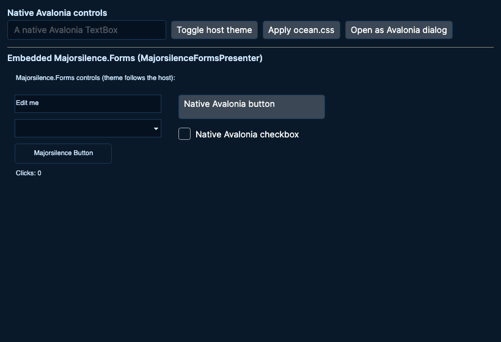

# CSS theming for native Avalonia apps

`Majorsilence.Forms.Theming.Avalonia` applies the same CSS theme subset described in
[theming.md](theming.md) to **native Avalonia controls** — Avalonia's own `Button`, `TextBox`, `Menu`,
`TabControl`, `DataGrid` and so on, under the Fluent theme. It exists for apps that are only partly
Majorsilence.Forms: an Avalonia shell with its own views next to Majorsilence.Forms surfaces, or an
Avalonia launcher for a WinForms client themed by
[`Majorsilence.Forms.Theming.WinForms`](theming-winforms.md). Without it the Majorsilence half follows
the `.css` file and the Avalonia half does not. With it, one stylesheet — same tokens, same selectors,
same diagnostics — restyles both, as far as Avalonia's Fluent theme allows.

`net8.0` / `net10.0`, every Avalonia desktop platform. It depends on the Majorsilence.Forms core for the
parser and the host-neutral `ThemeStyleSheet.Tokens` / `Rules` / `Variables` model, on `Avalonia` and on
`Avalonia.Controls.DataGrid` — not on the `Majorsilence.Forms.Avalonia` backend.

## Using it

```csharp
using Majorsilence.Forms.Theming.Avalonia;

public partial class App : Application
{
    public override void Initialize () => AvaloniaXamlLoader.Load (this);   // FluentTheme in App.axaml

    public override void OnFrameworkInitializationCompleted ()
    {
        // Once the Application exists. Throws ThemeCssException on errors.
        AvaloniaCssTheme.Apply (File.ReadAllText ("Themes/brand.css"));

        if (ApplicationLifetime is IClassicDesktopStyleApplicationLifetime desktop)
            desktop.MainWindow = new MainWindow ();

        base.OnFrameworkInitializationCompleted ();
    }
}
```

| Member | What it does |
|---|---|
| `AvaloniaCssTheme.Apply (string css)` | Parses, throws `ThemeCssException` on errors, applies to `Theme` and to the current Avalonia application. |
| `AvaloniaCssTheme.Apply (ThemeStyleSheet sheet)` | Applies whatever parsed, errors or not — what a live editor wants mid-edit. |
| `AvaloniaCssTheme.Watch (path)` | Applies the file now and again on every save (debounced, marshalled to the UI thread). Dispose the returned watcher to stop. |
| `AvaloniaCssTheme.SetThemeVariant` | Whether an apply also sets `Application.RequestedThemeVariant` to Light or Dark from the background luminance (default `true`). |
| `AvaloniaCssTheme.Diagnostics` | What Avalonia could not express in the last apply (see below). |
| `AvaloniaCssTheme.Support` / `AvaloniaThemeSupport` | The property × control matrix this page is generated from. |

Every apply also runs `Theme.ApplyStyleSheet`, so embedded Majorsilence.Forms surfaces change with the
native controls; and once any member of `AvaloniaCssTheme` has been used, a sheet applied from the
Majorsilence.Forms side (`Theme.LoadFromCss`, `Theme.ApplyTheme`) is mirrored onto Avalonia through
`Theme.StyleSheetApplied`. `Majorsilence.Forms.Theming.WinForms` does the same, so one
`Theme.LoadFromCss` in a process that uses both reaches all three hosts.

### Both halves, one sheet



`samples/EmbeddingAvalonia` is an Avalonia window with native controls above and an embedded
Majorsilence.Forms scene below (`MajorsilenceFormsPresenter`). Its **Apply ocean.css** button, or
`--theme`, applies one stylesheet to both halves. The picture above was made offscreen by the sample
itself:

```bash
dotnet run --project samples/EmbeddingAvalonia -- --theme samples/ThemeStudio/Themes/ocean.css
dotnet run --project samples/EmbeddingAvalonia -- --render-headless out.png --theme samples/ThemeStudio/Themes/ocean.css
```

The embedded presenter calls `MajorsilenceFormsTheme.FollowHost`, which keeps the Majorsilence theme in
step with the host's light/dark variant. **A CSS theme wins over following the host.** On a variant
change the matching built-in theme is put under the applied sheet and the sheet re-applied, so the
sheet's own tokens stay, what it leaves unset follows the host, and a sheet that `extends Light` or
`Dark` keeps that base. This matters because applying a sheet here sets `RequestedThemeVariant`
itself: before #104, that variant change reset the embedded half to a built-in theme the moment the
sheet was applied.

Theme Studio has the same pairing on its **Native Avalonia** tab (`--tab 4`): one of each mapped
native control, restyled by every edit next to the Majorsilence preview.

## How it works

Avalonia's Fluent control themes read their colours through `{DynamicResource}` keys and bind their
geometry to control properties. The applier uses both seams:

- **Colours become Fluent resources.** `Button { background-color }` writes `ButtonBackground`,
  `Button:hover { background-color }` writes `ButtonBackgroundPointerOver` (and a slightly darker
  `ButtonBackgroundPressed`), `TabStrip::selected { border-bottom-color }` writes
  `TabItemHeaderSelectedPipeFill`, and so on. They go into one `ResourceDictionary` merged into
  `Application.Resources`, so every state that uses a key follows — including hover and selection
  colours that Fluent sets on template parts, where a style on the control itself cannot reach. A test
  checks every key the matrix writes against the real Fluent and DataGrid themes, with its type.
- **Geometry and fonts become style setters.** `border-width` (and the per-side widths, assembled into
  one `Thickness`), `border-radius`, `font-*` and the colours of controls without a Fluent resource are
  setters in one generated `Styles` appended to `Application.Styles`. Application styles outrank the
  Fluent control themes, so they win over its defaults.
- **Tokens** drive the Fluent system resources — `SystemAccentColor` and its Light1–3 / Dark1–3 ramp from
  `--accent-color`, `TextControlSelectionHighlightColor` from `--text-selection-background-color`,
  `ContentControlThemeFontFamily` / `ControlContentThemeFontSize` from `--ui-font` / `--font-size` when
  the sheet declares them — and every `Window`'s `Background` / `Foreground` from `--background-color` /
  `--foreground-color` (inherited by the controls inside).
- **Theme variant.** With `SetThemeVariant` on, a dark `--background-color` sets
  `RequestedThemeVariant = Dark` so Fluent's own dark resources match; a light one sets `Light`.
- A re-apply swaps both the dictionary and the `Styles` for new ones, so whatever the new sheet no
  longer says falls back to Fluent's defaults.

### Tokens and variables for your own views

Every theme token and every **author variable** in `:root` (a custom property that is not a token) is
also published as a resource under its PascalCase name, so your own views can follow the stylesheet:

| CSS | Resources |
|---|---|
| `--line2: #C9D5E0;` | `Line2` (`SolidColorBrush`), `Line2Color` (`Color`) |
| `--ts-blue-mid: #6B95BE;` | `TsBlueMid`, `TsBlueMidColor` |
| `--accent-color: …;` (a token) | `AccentColor` (`Color`), `AccentBrush` (`SolidColorBrush`) — a name ending in `Color` keeps it for the colour |
| `--radius: 8px;` | `Radius` (`double`) |
| `--brand-font: "Dax", sans-serif;` | `BrandFont` (`FontFamily`) |

```xml
<Border BorderBrush="{DynamicResource Line2}" Background="{DynamicResource AccentTint}" />
```

Author variables read by nothing but your views are fine: the parser warns that such a variable is
"never used" by Majorsilence.Forms controls, which is true, and the Avalonia applier still publishes it.

Resources the app declares **directly** in `Application.Resources` (not in a merged dictionary) win over
the published ones, as they should — remove a hand-written `SystemAccentColor` there when the stylesheet
is meant to own it.

### Diagnostics

The rule the whole subset is built on is *never silently no-op*. Every declaration in an applied sheet
is checked against the matrix:

| Situation | Severity | Example |
|---|---|---|
| Selector with no Avalonia counterpart | info | `'ToolBar' has no Avalonia counterpart; the rule styles Majorsilence.Forms controls only.` |
| Property that applies approximately | info | `'Menu { border-bottom-color }' applies approximately on Avalonia (Menu ...): Avalonia controls have one BorderBrush; ...` |
| Property Avalonia cannot express | warning | `'Form { border-color }' is not supported on Avalonia (Window) and was skipped there: ...` |

They use the same `ThemeCssDiagnostic` type as the parser. Parse problems stay on the sheet
(`ThemeStyleSheet.Diagnostics`); the Avalonia list is `AvaloniaCssTheme.Diagnostics`.

## Support matrix

Generated from `AvaloniaThemeSupport`; a test fails when the code and this section drift. Regenerate
with `MAJORSILENCE_WRITE_THEMING_AVALONIA_DOC=1 dotnet test tests/Majorsilence.Forms.Theming.Avalonia.Tests`.

<!-- BEGIN GENERATED: avalonia-support (AvaloniaThemeSupport.ToMarkdown) -->
### Selector mapping

| Selector | Avalonia | Notes |
|---|---|---|
| `Button` | `Button, ToggleButton` | Colours go to the Fluent Button*/ToggleButton* resources (so every state follows); geometry and fonts are style setters. |
| `CheckBox` | `CheckBox` | Text colour and backdrop through the CheckBox* resources; the box glyph follows --accent-color. |
| `ComboBox` | `ComboBox` | The closed box through the ComboBox* resources; the open list follows the ListBox rules. |
| `DataGridView` | `DataGrid (Avalonia.Controls.DataGrid)` | The grid is style setters; headers, rows and selection are the DataGrid* resources and row styles. |
| `DateTimePicker` | — | No counterpart: Avalonia's DatePicker is themed by its own template, which this matrix does not map. |
| `DockWindowBase` | — | A Majorsilence.Forms.Telerik control with no Avalonia counterpart. |
| `Form` | `Window` | Style setters on every Window; Foreground and the font properties are inherited by the controls inside. |
| `FormTitleBar` | — | No counterpart: Avalonia windows draw their own chrome. |
| `GroupBox` | — | Avalonia has no GroupBox; a HeaderedContentControl or a Border with a header has no Fluent theme to restyle. |
| `HostedSurface` | — | No counterpart: it is the surface Majorsilence.Forms embeds in an Avalonia host. |
| `Label` | `Label` | Style setters on Avalonia's Label (TextBlock is left alone: it is the text inside every control). |
| `LinkLabel` | `HyperlinkButton` | The HyperlinkButton* resources; :hover is pointer-over (and pressed). |
| `ListBox` | `ListBox` | The control is style setters; ::selection writes Fluent's shared list-accent resources. |
| `ListView` | — | Avalonia has no ListView; use ListBox (the ListBox rules) or DataGrid (the DataGridView rules). |
| `MdiClient` | — | No counterpart: Avalonia has no MDI workspace. |
| `Menu` | `Menu (and its top-level MenuItems)` | The bar is style setters; ::item targets the top-level MenuItems, :hover their pointer-over template parts. |
| `MenuDropDown` | `MenuFlyoutPresenter, ContextMenu (and their MenuItems)` | The MenuFlyoutPresenter* and MenuFlyoutItem* resources, shared by drop-downs and context menus. |
| `MonthCalendar` | `Calendar` | The CalendarView* resources; the selected day uses --accent-color. |
| `NavigationPane` | — | Avalonia has no Outlook-style navigation pane. |
| `NumericUpDown` | `NumericUpDown` | Style setters on the spinner; its inner text editor also follows the TextBox rule. |
| `Panel` | — | Avalonia panels are layout primitives used inside every control template; restyling them would restyle the controls' internals. |
| `PictureBox` | — | Avalonia's Image has no background or border. |
| `PopupWindow` | — | No counterpart: Avalonia popups are themed by their own templates. |
| `PrintPreviewControl` | — | No counterpart: Avalonia has no print preview control. |
| `ProgressBar` | — | No counterpart: Avalonia's ProgressBar is themed by its own template, which this matrix does not map. |
| `PropertyGrid` | — | Avalonia has no PropertyGrid. |
| `RadCommandBar` | — | A Majorsilence.Forms.Telerik control with no Avalonia counterpart. |
| `RadPdfViewerNavigator` | — | A Majorsilence.Forms.Telerik control with no Avalonia counterpart. |
| `RadRibbonBar` | — | A Majorsilence.Forms.Telerik control with no Avalonia counterpart. |
| `RadScheduler` | — | A Majorsilence.Forms.Telerik control with no Avalonia counterpart. |
| `RadSchedulerNavigator` | — | A Majorsilence.Forms.Telerik control with no Avalonia counterpart. |
| `RadStatusStrip` | — | A Majorsilence.Forms.Telerik control with no Avalonia counterpart. |
| `RadioButton` | `RadioButton` | Text colour, backdrop and the ring outline through the RadioButton* resources. |
| `Ribbon` | — | Avalonia has no ribbon control. |
| `RichTextEditorRibbonBar` | — | A Majorsilence.Forms.Telerik control with no Avalonia counterpart. |
| `ScrollBar` | `ScrollBar` | The ScrollBar* resources: track, thumb and line buttons. |
| `SplitContainer` | `GridSplitter` | The splitter bar's background. |
| `Splitter` | `GridSplitter` | The splitter bar's background. |
| `StatusBar` | — | Avalonia has no status bar control; bind your own status row to the published token resources instead. |
| `StatusStrip` | — | Avalonia has no status bar control; bind your own status row to the published token resources instead. |
| `TabControl` | `TabControl` | Style setters on the TabControl (the frame around the pages). |
| `TabStrip` | `TabItem headers (TabControl)` | The TabItemHeader* resources; Avalonia's tab row has no brush of its own, so the strip's own colours apply to the unselected tabs. |
| `TextBox` | `TextBox, CalendarDatePicker` | Colours go to the TextControl* (and CalendarDatePicker*) resources, so NumericUpDown's and ComboBox's inner editors follow too; the focused state keeps Fluent's accent border. |
| `ToolBar` | — | Avalonia has no tool bar control; bind your own tool row to the published token resources instead. |
| `TrackBar` | `Slider` | The slider's container through SliderContainerBackground; the track and thumb follow --accent-color. |
| `TreeView` | `TreeView` | The control is style setters; ::selection writes the TreeViewItem*Selected resources. |

### Property support

Unsupported rows are reported as diagnostics when a stylesheet uses them — never silently ignored.

| Rule | Property | Support | Writes | Notes |
|---|---|---|---|---|
| `Button` | `background-color` | native | `ButtonBackground`<br>`ToggleButtonBackground` | ButtonBackground / ToggleButtonBackground. |
| `Button` | `color` | native | `ButtonForeground`<br>`ToggleButtonForeground` | ButtonForeground / ToggleButtonForeground. |
| `Button` | `border-color` | native | `ButtonBorderBrush`<br>`ToggleButtonBorderBrush` | ButtonBorderBrush / ToggleButtonBorderBrush. |
| `Button` | `border-width` | native | `Button { BorderThickness }`<br>`ToggleButton { BorderThickness }` | A setter in the generated Styles (application styles outrank the Fluent control theme). |
| `Button` | `border-radius` | native | `Button { CornerRadius }`<br>`ToggleButton { CornerRadius }` | A setter in the generated Styles (application styles outrank the Fluent control theme). |
| `Button` | `border-top-width` | native | `Button { BorderThickness }`<br>`ToggleButton { BorderThickness }` | A setter in the generated Styles (application styles outrank the Fluent control theme). |
| `Button` | `border-right-width` | native | `Button { BorderThickness }`<br>`ToggleButton { BorderThickness }` | A setter in the generated Styles (application styles outrank the Fluent control theme). |
| `Button` | `border-bottom-width` | native | `Button { BorderThickness }`<br>`ToggleButton { BorderThickness }` | A setter in the generated Styles (application styles outrank the Fluent control theme). |
| `Button` | `border-left-width` | native | `Button { BorderThickness }`<br>`ToggleButton { BorderThickness }` | A setter in the generated Styles (application styles outrank the Fluent control theme). |
| `Button` | `font-family` | native | `Button { FontFamily }`<br>`ToggleButton { FontFamily }` | A setter in the generated Styles (application styles outrank the Fluent control theme). |
| `Button` | `font-size` | native | `Button { FontSize }`<br>`ToggleButton { FontSize }` | A setter in the generated Styles (application styles outrank the Fluent control theme). |
| `Button` | `font-weight` | native | `Button { FontWeight }`<br>`ToggleButton { FontWeight }` | A setter in the generated Styles (application styles outrank the Fluent control theme). |
| `Button` | `font-style` | native | `Button { FontStyle }`<br>`ToggleButton { FontStyle }` | A setter in the generated Styles (application styles outrank the Fluent control theme). |
| `Button` | `border-top-color` | approximate | `Button { BorderBrush }`<br>`ToggleButton { BorderBrush }` | Avalonia controls have one BorderBrush; a side colour colours every side that has a width. |
| `Button` | `border-right-color` | approximate | `Button { BorderBrush }`<br>`ToggleButton { BorderBrush }` | Avalonia controls have one BorderBrush; a side colour colours every side that has a width. |
| `Button` | `border-bottom-color` | approximate | `Button { BorderBrush }`<br>`ToggleButton { BorderBrush }` | Avalonia controls have one BorderBrush; a side colour colours every side that has a width. |
| `Button` | `border-left-color` | approximate | `Button { BorderBrush }`<br>`ToggleButton { BorderBrush }` | Avalonia controls have one BorderBrush; a side colour colours every side that has a width. |
| `Button:hover` | `background-color` | native | `ButtonBackgroundPointerOver`<br>`ButtonBackgroundPressed`<br>`ToggleButtonBackgroundPointerOver`<br>`ToggleButtonBackgroundPressed` | The pointer-over fill; the pressed fill is the same colour, slightly darker. |
| `Button:hover` | `color` | native | `ButtonForegroundPointerOver`<br>`ButtonForegroundPressed`<br>`ToggleButtonForegroundPointerOver`<br>`ToggleButtonForegroundPressed` | The pointer-over and pressed text colour. |
| `Button:hover` | `border-color` | native | `ButtonBorderBrushPointerOver`<br>`ButtonBorderBrushPressed`<br>`ToggleButtonBorderBrushPointerOver`<br>`ToggleButtonBorderBrushPressed` | The pointer-over and pressed border. |
| `CheckBox` | `background-color` | native | `CheckBoxBackgroundUnchecked`<br>`CheckBoxBackgroundChecked`<br>`CheckBoxBackgroundIndeterminate` | The backdrop behind the box and caption, in every check state. |
| `CheckBox` | `color` | native | `CheckBoxForegroundUnchecked`<br>`CheckBoxForegroundChecked`<br>`CheckBoxForegroundIndeterminate`<br>`CheckBoxForegroundUncheckedPointerOver`<br>`CheckBoxForegroundCheckedPointerOver`<br>`CheckBoxForegroundIndeterminatePointerOver` | The caption, in every check state (pointer-over included). |
| `CheckBox` | `border-color` | approximate | `CheckBoxCheckBackgroundStrokeUnchecked` | The outline of the unchecked box (the checked box is filled with the accent). |
| `CheckBox` | `font-family` | native | `CheckBox { FontFamily }` | A setter in the generated Styles (application styles outrank the Fluent control theme). |
| `CheckBox` | `font-size` | native | `CheckBox { FontSize }` | A setter in the generated Styles (application styles outrank the Fluent control theme). |
| `CheckBox` | `font-weight` | native | `CheckBox { FontWeight }` | A setter in the generated Styles (application styles outrank the Fluent control theme). |
| `CheckBox` | `font-style` | native | `CheckBox { FontStyle }` | A setter in the generated Styles (application styles outrank the Fluent control theme). |
| `RadioButton` | `background-color` | native | `RadioButtonBackground` | The backdrop behind the ring and caption. |
| `RadioButton` | `color` | native | `RadioButtonForeground`<br>`RadioButtonForegroundPointerOver` | The caption (pointer-over included). |
| `RadioButton` | `border-color` | approximate | `RadioButtonOuterEllipseStroke` | The outer ring's stroke. |
| `RadioButton` | `font-family` | native | `RadioButton { FontFamily }` | A setter in the generated Styles (application styles outrank the Fluent control theme). |
| `RadioButton` | `font-size` | native | `RadioButton { FontSize }` | A setter in the generated Styles (application styles outrank the Fluent control theme). |
| `RadioButton` | `font-weight` | native | `RadioButton { FontWeight }` | A setter in the generated Styles (application styles outrank the Fluent control theme). |
| `RadioButton` | `font-style` | native | `RadioButton { FontStyle }` | A setter in the generated Styles (application styles outrank the Fluent control theme). |
| `LinkLabel` | `color` | native | `HyperlinkButtonForeground` | HyperlinkButtonForeground. |
| `LinkLabel` | `background-color` | native | `HyperlinkButtonBackground` | HyperlinkButtonBackground. |
| `LinkLabel` | `border-color` | native | `HyperlinkButtonBorderBrush` | HyperlinkButtonBorderBrush. |
| `LinkLabel` | `border-width` | native | `HyperlinkButton { BorderThickness }` | A setter in the generated Styles (application styles outrank the Fluent control theme). |
| `LinkLabel` | `border-radius` | native | `HyperlinkButton { CornerRadius }` | A setter in the generated Styles (application styles outrank the Fluent control theme). |
| `LinkLabel` | `border-top-width` | native | `HyperlinkButton { BorderThickness }` | A setter in the generated Styles (application styles outrank the Fluent control theme). |
| `LinkLabel` | `border-right-width` | native | `HyperlinkButton { BorderThickness }` | A setter in the generated Styles (application styles outrank the Fluent control theme). |
| `LinkLabel` | `border-bottom-width` | native | `HyperlinkButton { BorderThickness }` | A setter in the generated Styles (application styles outrank the Fluent control theme). |
| `LinkLabel` | `border-left-width` | native | `HyperlinkButton { BorderThickness }` | A setter in the generated Styles (application styles outrank the Fluent control theme). |
| `LinkLabel` | `font-family` | native | `HyperlinkButton { FontFamily }` | A setter in the generated Styles (application styles outrank the Fluent control theme). |
| `LinkLabel` | `font-size` | native | `HyperlinkButton { FontSize }` | A setter in the generated Styles (application styles outrank the Fluent control theme). |
| `LinkLabel` | `font-weight` | native | `HyperlinkButton { FontWeight }` | A setter in the generated Styles (application styles outrank the Fluent control theme). |
| `LinkLabel` | `font-style` | native | `HyperlinkButton { FontStyle }` | A setter in the generated Styles (application styles outrank the Fluent control theme). |
| `LinkLabel` | `border-top-color` | approximate | `HyperlinkButton { BorderBrush }` | Avalonia controls have one BorderBrush; a side colour colours every side that has a width. |
| `LinkLabel` | `border-right-color` | approximate | `HyperlinkButton { BorderBrush }` | Avalonia controls have one BorderBrush; a side colour colours every side that has a width. |
| `LinkLabel` | `border-bottom-color` | approximate | `HyperlinkButton { BorderBrush }` | Avalonia controls have one BorderBrush; a side colour colours every side that has a width. |
| `LinkLabel` | `border-left-color` | approximate | `HyperlinkButton { BorderBrush }` | Avalonia controls have one BorderBrush; a side colour colours every side that has a width. |
| `LinkLabel:hover` | `color` | native | `HyperlinkButtonForegroundPointerOver`<br>`HyperlinkButtonForegroundPressed` | The pointer-over and pressed link colour. |
| `LinkLabel:hover` | `background-color` | native | `HyperlinkButtonBackgroundPointerOver`<br>`HyperlinkButtonBackgroundPressed` | The pointer-over and pressed fill. |
| `LinkLabel:hover` | `border-color` | native | `HyperlinkButtonBorderBrushPointerOver`<br>`HyperlinkButtonBorderBrushPressed` | The pointer-over and pressed border. |
| `TextBox` | `background-color` | native | `TextControlBackground`<br>`CalendarDatePickerBackground` | The resting fill (focused keeps Fluent's). |
| `TextBox` | `color` | native | `TextControlForeground`<br>`TextControlForegroundPointerOver`<br>`TextControlForegroundFocused`<br>`CalendarDatePickerForeground`<br>`CalendarDatePickerTextForeground` | The text, at rest, pointer-over and focused. |
| `TextBox` | `border-color` | native | `TextControlBorderBrush`<br>`CalendarDatePickerBorderBrush` | The resting border (focused keeps the accent). |
| `TextBox` | `border-width` | native | `TextBox { BorderThickness }`<br>`CalendarDatePicker { BorderThickness }` | A setter in the generated Styles (application styles outrank the Fluent control theme). |
| `TextBox` | `border-radius` | native | `TextBox { CornerRadius }`<br>`CalendarDatePicker { CornerRadius }` | A setter in the generated Styles (application styles outrank the Fluent control theme). |
| `TextBox` | `border-top-width` | native | `TextBox { BorderThickness }`<br>`CalendarDatePicker { BorderThickness }` | A setter in the generated Styles (application styles outrank the Fluent control theme). |
| `TextBox` | `border-right-width` | native | `TextBox { BorderThickness }`<br>`CalendarDatePicker { BorderThickness }` | A setter in the generated Styles (application styles outrank the Fluent control theme). |
| `TextBox` | `border-bottom-width` | native | `TextBox { BorderThickness }`<br>`CalendarDatePicker { BorderThickness }` | A setter in the generated Styles (application styles outrank the Fluent control theme). |
| `TextBox` | `border-left-width` | native | `TextBox { BorderThickness }`<br>`CalendarDatePicker { BorderThickness }` | A setter in the generated Styles (application styles outrank the Fluent control theme). |
| `TextBox` | `font-family` | native | `TextBox { FontFamily }`<br>`CalendarDatePicker { FontFamily }` | A setter in the generated Styles (application styles outrank the Fluent control theme). |
| `TextBox` | `font-size` | native | `TextBox { FontSize }`<br>`CalendarDatePicker { FontSize }` | A setter in the generated Styles (application styles outrank the Fluent control theme). |
| `TextBox` | `font-weight` | native | `TextBox { FontWeight }`<br>`CalendarDatePicker { FontWeight }` | A setter in the generated Styles (application styles outrank the Fluent control theme). |
| `TextBox` | `font-style` | native | `TextBox { FontStyle }`<br>`CalendarDatePicker { FontStyle }` | A setter in the generated Styles (application styles outrank the Fluent control theme). |
| `TextBox` | `border-top-color` | approximate | `TextBox { BorderBrush }`<br>`CalendarDatePicker { BorderBrush }` | Avalonia controls have one BorderBrush; a side colour colours every side that has a width. |
| `TextBox` | `border-right-color` | approximate | `TextBox { BorderBrush }`<br>`CalendarDatePicker { BorderBrush }` | Avalonia controls have one BorderBrush; a side colour colours every side that has a width. |
| `TextBox` | `border-bottom-color` | approximate | `TextBox { BorderBrush }`<br>`CalendarDatePicker { BorderBrush }` | Avalonia controls have one BorderBrush; a side colour colours every side that has a width. |
| `TextBox` | `border-left-color` | approximate | `TextBox { BorderBrush }`<br>`CalendarDatePicker { BorderBrush }` | Avalonia controls have one BorderBrush; a side colour colours every side that has a width. |
| `ComboBox` | `background-color` | native | `ComboBoxBackground` | ComboBoxBackground. |
| `ComboBox` | `color` | native | `ComboBoxForeground` | ComboBoxForeground. |
| `ComboBox` | `border-color` | native | `ComboBoxBorderBrush` | ComboBoxBorderBrush. |
| `ComboBox` | `border-width` | native | `ComboBox { BorderThickness }` | A setter in the generated Styles (application styles outrank the Fluent control theme). |
| `ComboBox` | `border-radius` | native | `ComboBox { CornerRadius }` | A setter in the generated Styles (application styles outrank the Fluent control theme). |
| `ComboBox` | `border-top-width` | native | `ComboBox { BorderThickness }` | A setter in the generated Styles (application styles outrank the Fluent control theme). |
| `ComboBox` | `border-right-width` | native | `ComboBox { BorderThickness }` | A setter in the generated Styles (application styles outrank the Fluent control theme). |
| `ComboBox` | `border-bottom-width` | native | `ComboBox { BorderThickness }` | A setter in the generated Styles (application styles outrank the Fluent control theme). |
| `ComboBox` | `border-left-width` | native | `ComboBox { BorderThickness }` | A setter in the generated Styles (application styles outrank the Fluent control theme). |
| `ComboBox` | `font-family` | native | `ComboBox { FontFamily }` | A setter in the generated Styles (application styles outrank the Fluent control theme). |
| `ComboBox` | `font-size` | native | `ComboBox { FontSize }` | A setter in the generated Styles (application styles outrank the Fluent control theme). |
| `ComboBox` | `font-weight` | native | `ComboBox { FontWeight }` | A setter in the generated Styles (application styles outrank the Fluent control theme). |
| `ComboBox` | `font-style` | native | `ComboBox { FontStyle }` | A setter in the generated Styles (application styles outrank the Fluent control theme). |
| `ComboBox` | `border-top-color` | approximate | `ComboBox { BorderBrush }` | Avalonia controls have one BorderBrush; a side colour colours every side that has a width. |
| `ComboBox` | `border-right-color` | approximate | `ComboBox { BorderBrush }` | Avalonia controls have one BorderBrush; a side colour colours every side that has a width. |
| `ComboBox` | `border-bottom-color` | approximate | `ComboBox { BorderBrush }` | Avalonia controls have one BorderBrush; a side colour colours every side that has a width. |
| `ComboBox` | `border-left-color` | approximate | `ComboBox { BorderBrush }` | Avalonia controls have one BorderBrush; a side colour colours every side that has a width. |
| `NumericUpDown` | `background-color` | native | `NumericUpDown { Background }` | A setter in the generated Styles (application styles outrank the Fluent control theme). |
| `NumericUpDown` | `color` | native | `NumericUpDown { Foreground }` | A setter in the generated Styles (application styles outrank the Fluent control theme). |
| `NumericUpDown` | `border-color` | native | `NumericUpDown { BorderBrush }` | A setter in the generated Styles (application styles outrank the Fluent control theme). |
| `NumericUpDown` | `border-width` | native | `NumericUpDown { BorderThickness }` | A setter in the generated Styles (application styles outrank the Fluent control theme). |
| `NumericUpDown` | `border-radius` | native | `NumericUpDown { CornerRadius }` | A setter in the generated Styles (application styles outrank the Fluent control theme). |
| `NumericUpDown` | `border-top-width` | native | `NumericUpDown { BorderThickness }` | A setter in the generated Styles (application styles outrank the Fluent control theme). |
| `NumericUpDown` | `border-right-width` | native | `NumericUpDown { BorderThickness }` | A setter in the generated Styles (application styles outrank the Fluent control theme). |
| `NumericUpDown` | `border-bottom-width` | native | `NumericUpDown { BorderThickness }` | A setter in the generated Styles (application styles outrank the Fluent control theme). |
| `NumericUpDown` | `border-left-width` | native | `NumericUpDown { BorderThickness }` | A setter in the generated Styles (application styles outrank the Fluent control theme). |
| `NumericUpDown` | `font-family` | native | `NumericUpDown { FontFamily }` | A setter in the generated Styles (application styles outrank the Fluent control theme). |
| `NumericUpDown` | `font-size` | native | `NumericUpDown { FontSize }` | A setter in the generated Styles (application styles outrank the Fluent control theme). |
| `NumericUpDown` | `font-weight` | native | `NumericUpDown { FontWeight }` | A setter in the generated Styles (application styles outrank the Fluent control theme). |
| `NumericUpDown` | `font-style` | native | `NumericUpDown { FontStyle }` | A setter in the generated Styles (application styles outrank the Fluent control theme). |
| `NumericUpDown` | `border-top-color` | approximate | `NumericUpDown { BorderBrush }` | Avalonia controls have one BorderBrush; a side colour colours every side that has a width. |
| `NumericUpDown` | `border-right-color` | approximate | `NumericUpDown { BorderBrush }` | Avalonia controls have one BorderBrush; a side colour colours every side that has a width. |
| `NumericUpDown` | `border-bottom-color` | approximate | `NumericUpDown { BorderBrush }` | Avalonia controls have one BorderBrush; a side colour colours every side that has a width. |
| `NumericUpDown` | `border-left-color` | approximate | `NumericUpDown { BorderBrush }` | Avalonia controls have one BorderBrush; a side colour colours every side that has a width. |
| `Label` | `background-color` | native | `Label { Background }` | A setter in the generated Styles (application styles outrank the Fluent control theme). |
| `Label` | `color` | native | `Label { Foreground }` | A setter in the generated Styles (application styles outrank the Fluent control theme). |
| `Label` | `border-width` | native | `Label { BorderThickness }` | A setter in the generated Styles (application styles outrank the Fluent control theme). |
| `Label` | `border-color` | native | `Label { BorderBrush }` | A setter in the generated Styles (application styles outrank the Fluent control theme). |
| `Label` | `border-radius` | native | `Label { CornerRadius }` | A setter in the generated Styles (application styles outrank the Fluent control theme). |
| `Label` | `border-top-width` | native | `Label { BorderThickness }` | A setter in the generated Styles (application styles outrank the Fluent control theme). |
| `Label` | `border-right-width` | native | `Label { BorderThickness }` | A setter in the generated Styles (application styles outrank the Fluent control theme). |
| `Label` | `border-bottom-width` | native | `Label { BorderThickness }` | A setter in the generated Styles (application styles outrank the Fluent control theme). |
| `Label` | `border-left-width` | native | `Label { BorderThickness }` | A setter in the generated Styles (application styles outrank the Fluent control theme). |
| `Label` | `border-top-color` | approximate | `Label { BorderBrush }` | Avalonia controls have one BorderBrush; a side colour colours every side that has a width. |
| `Label` | `border-right-color` | approximate | `Label { BorderBrush }` | Avalonia controls have one BorderBrush; a side colour colours every side that has a width. |
| `Label` | `border-bottom-color` | approximate | `Label { BorderBrush }` | Avalonia controls have one BorderBrush; a side colour colours every side that has a width. |
| `Label` | `border-left-color` | approximate | `Label { BorderBrush }` | Avalonia controls have one BorderBrush; a side colour colours every side that has a width. |
| `Label` | `font-family` | native | `Label { FontFamily }` | A setter in the generated Styles (application styles outrank the Fluent control theme). |
| `Label` | `font-size` | native | `Label { FontSize }` | A setter in the generated Styles (application styles outrank the Fluent control theme). |
| `Label` | `font-weight` | native | `Label { FontWeight }` | A setter in the generated Styles (application styles outrank the Fluent control theme). |
| `Label` | `font-style` | native | `Label { FontStyle }` | A setter in the generated Styles (application styles outrank the Fluent control theme). |
| `ListBox` | `background-color` | native | `ListBox { Background }` | A setter in the generated Styles (application styles outrank the Fluent control theme). |
| `ListBox` | `color` | native | `ListBox { Foreground }` | A setter in the generated Styles (application styles outrank the Fluent control theme). |
| `ListBox` | `border-width` | native | `ListBox { BorderThickness }` | A setter in the generated Styles (application styles outrank the Fluent control theme). |
| `ListBox` | `border-color` | native | `ListBox { BorderBrush }` | A setter in the generated Styles (application styles outrank the Fluent control theme). |
| `ListBox` | `border-radius` | native | `ListBox { CornerRadius }` | A setter in the generated Styles (application styles outrank the Fluent control theme). |
| `ListBox` | `border-top-width` | native | `ListBox { BorderThickness }` | A setter in the generated Styles (application styles outrank the Fluent control theme). |
| `ListBox` | `border-right-width` | native | `ListBox { BorderThickness }` | A setter in the generated Styles (application styles outrank the Fluent control theme). |
| `ListBox` | `border-bottom-width` | native | `ListBox { BorderThickness }` | A setter in the generated Styles (application styles outrank the Fluent control theme). |
| `ListBox` | `border-left-width` | native | `ListBox { BorderThickness }` | A setter in the generated Styles (application styles outrank the Fluent control theme). |
| `ListBox` | `border-top-color` | approximate | `ListBox { BorderBrush }` | Avalonia controls have one BorderBrush; a side colour colours every side that has a width. |
| `ListBox` | `border-right-color` | approximate | `ListBox { BorderBrush }` | Avalonia controls have one BorderBrush; a side colour colours every side that has a width. |
| `ListBox` | `border-bottom-color` | approximate | `ListBox { BorderBrush }` | Avalonia controls have one BorderBrush; a side colour colours every side that has a width. |
| `ListBox` | `border-left-color` | approximate | `ListBox { BorderBrush }` | Avalonia controls have one BorderBrush; a side colour colours every side that has a width. |
| `ListBox` | `font-family` | native | `ListBox { FontFamily }` | A setter in the generated Styles (application styles outrank the Fluent control theme). |
| `ListBox` | `font-size` | native | `ListBox { FontSize }` | A setter in the generated Styles (application styles outrank the Fluent control theme). |
| `ListBox` | `font-weight` | native | `ListBox { FontWeight }` | A setter in the generated Styles (application styles outrank the Fluent control theme). |
| `ListBox` | `font-style` | native | `ListBox { FontStyle }` | A setter in the generated Styles (application styles outrank the Fluent control theme). |
| `ListBox::selection` | `background-color` | approximate | `SystemControlHighlightListAccentLowBrush`<br>`SystemControlHighlightListAccentMediumBrush`<br>`SystemControlHighlightListAccentHighBrush` | SystemControlHighlightListAccent{Low,Medium,High}Brush: selected, selected + pointer-over, selected + pressed. Fluent shares these with other list-style controls. |
| `ListBox::selection` | `color` | native | `ListBoxItem:selected /template/ ContentPresenter#PART_ContentPresenter { Foreground }` | The selected item's content presenter. |
| `TreeView` | `background-color` | native | `TreeView { Background }` | A setter in the generated Styles (application styles outrank the Fluent control theme). |
| `TreeView` | `color` | native | `TreeView { Foreground }` | A setter in the generated Styles (application styles outrank the Fluent control theme). |
| `TreeView` | `border-width` | native | `TreeView { BorderThickness }` | A setter in the generated Styles (application styles outrank the Fluent control theme). |
| `TreeView` | `border-color` | native | `TreeView { BorderBrush }` | A setter in the generated Styles (application styles outrank the Fluent control theme). |
| `TreeView` | `border-radius` | native | `TreeView { CornerRadius }` | A setter in the generated Styles (application styles outrank the Fluent control theme). |
| `TreeView` | `border-top-width` | native | `TreeView { BorderThickness }` | A setter in the generated Styles (application styles outrank the Fluent control theme). |
| `TreeView` | `border-right-width` | native | `TreeView { BorderThickness }` | A setter in the generated Styles (application styles outrank the Fluent control theme). |
| `TreeView` | `border-bottom-width` | native | `TreeView { BorderThickness }` | A setter in the generated Styles (application styles outrank the Fluent control theme). |
| `TreeView` | `border-left-width` | native | `TreeView { BorderThickness }` | A setter in the generated Styles (application styles outrank the Fluent control theme). |
| `TreeView` | `border-top-color` | approximate | `TreeView { BorderBrush }` | Avalonia controls have one BorderBrush; a side colour colours every side that has a width. |
| `TreeView` | `border-right-color` | approximate | `TreeView { BorderBrush }` | Avalonia controls have one BorderBrush; a side colour colours every side that has a width. |
| `TreeView` | `border-bottom-color` | approximate | `TreeView { BorderBrush }` | Avalonia controls have one BorderBrush; a side colour colours every side that has a width. |
| `TreeView` | `border-left-color` | approximate | `TreeView { BorderBrush }` | Avalonia controls have one BorderBrush; a side colour colours every side that has a width. |
| `TreeView` | `font-family` | native | `TreeView { FontFamily }` | A setter in the generated Styles (application styles outrank the Fluent control theme). |
| `TreeView` | `font-size` | native | `TreeView { FontSize }` | A setter in the generated Styles (application styles outrank the Fluent control theme). |
| `TreeView` | `font-weight` | native | `TreeView { FontWeight }` | A setter in the generated Styles (application styles outrank the Fluent control theme). |
| `TreeView` | `font-style` | native | `TreeView { FontStyle }` | A setter in the generated Styles (application styles outrank the Fluent control theme). |
| `TreeView::selection` | `background-color` | native | `TreeViewItemBackgroundSelected`<br>`TreeViewItemBackgroundSelectedPointerOver`<br>`TreeViewItemBackgroundSelectedPressed` | Selected, selected + pointer-over and selected + pressed. |
| `TreeView::selection` | `color` | native | `TreeViewItemForegroundSelected`<br>`TreeViewItemForegroundSelectedPointerOver`<br>`TreeViewItemForegroundSelectedPressed` | Selected, selected + pointer-over and selected + pressed. |
| `DataGridView` | `background-color` | native | `DataGrid { Background }` | A setter in the generated Styles (application styles outrank the Fluent control theme). |
| `DataGridView` | `color` | native | `DataGrid { Foreground }` | A setter in the generated Styles (application styles outrank the Fluent control theme). |
| `DataGridView` | `border-width` | native | `DataGrid { BorderThickness }` | A setter in the generated Styles (application styles outrank the Fluent control theme). |
| `DataGridView` | `border-color` | native | `DataGrid { BorderBrush }` | A setter in the generated Styles (application styles outrank the Fluent control theme). |
| `DataGridView` | `border-radius` | native | `DataGrid { CornerRadius }` | A setter in the generated Styles (application styles outrank the Fluent control theme). |
| `DataGridView` | `border-top-width` | native | `DataGrid { BorderThickness }` | A setter in the generated Styles (application styles outrank the Fluent control theme). |
| `DataGridView` | `border-right-width` | native | `DataGrid { BorderThickness }` | A setter in the generated Styles (application styles outrank the Fluent control theme). |
| `DataGridView` | `border-bottom-width` | native | `DataGrid { BorderThickness }` | A setter in the generated Styles (application styles outrank the Fluent control theme). |
| `DataGridView` | `border-left-width` | native | `DataGrid { BorderThickness }` | A setter in the generated Styles (application styles outrank the Fluent control theme). |
| `DataGridView` | `border-top-color` | approximate | `DataGrid { BorderBrush }` | Avalonia controls have one BorderBrush; a side colour colours every side that has a width. |
| `DataGridView` | `border-right-color` | approximate | `DataGrid { BorderBrush }` | Avalonia controls have one BorderBrush; a side colour colours every side that has a width. |
| `DataGridView` | `border-bottom-color` | approximate | `DataGrid { BorderBrush }` | Avalonia controls have one BorderBrush; a side colour colours every side that has a width. |
| `DataGridView` | `border-left-color` | approximate | `DataGrid { BorderBrush }` | Avalonia controls have one BorderBrush; a side colour colours every side that has a width. |
| `DataGridView` | `font-family` | native | `DataGrid { FontFamily }` | A setter in the generated Styles (application styles outrank the Fluent control theme). |
| `DataGridView` | `font-size` | native | `DataGrid { FontSize }` | A setter in the generated Styles (application styles outrank the Fluent control theme). |
| `DataGridView` | `font-weight` | native | `DataGrid { FontWeight }` | A setter in the generated Styles (application styles outrank the Fluent control theme). |
| `DataGridView` | `font-style` | native | `DataGrid { FontStyle }` | A setter in the generated Styles (application styles outrank the Fluent control theme). |
| `DataGridView::header` | `background-color` | native | `DataGridColumnHeaderBackgroundBrush` | DataGridColumnHeaderBackgroundBrush. |
| `DataGridView::header` | `color` | native | `DataGridColumnHeaderForegroundBrush` | DataGridColumnHeaderForegroundBrush. |
| `DataGridView::header` | `font-family` | native | `DataGridColumnHeader { FontFamily }` | A setter in the generated Styles (application styles outrank the Fluent control theme). |
| `DataGridView::header` | `font-size` | native | `DataGridColumnHeader { FontSize }` | A setter in the generated Styles (application styles outrank the Fluent control theme). |
| `DataGridView::header` | `font-weight` | native | `DataGridColumnHeader { FontWeight }` | A setter in the generated Styles (application styles outrank the Fluent control theme). |
| `DataGridView::header` | `font-style` | native | `DataGridColumnHeader { FontStyle }` | A setter in the generated Styles (application styles outrank the Fluent control theme). |
| `DataGridView::row-header` | `background-color` | native | `DataGridRowHeader { Background }` | A setter in the generated Styles (application styles outrank the Fluent control theme). |
| `DataGridView::row-header` | `color` | native | `DataGridRowHeader { Foreground }` | A setter in the generated Styles (application styles outrank the Fluent control theme). |
| `DataGridView::selection` | `background-color` | native | `DataGridRowSelectedBackgroundBrush`<br>`DataGridRowSelectedUnfocusedBackgroundBrush`<br>`DataGridRowSelectedHoveredBackgroundBrush`<br>`DataGridRowSelectedHoveredUnfocusedBackgroundBrush`<br>`DataGridRowSelectedBackgroundOpacity`<br>`DataGridRowSelectedUnfocusedBackgroundOpacity`<br>`DataGridRowSelectedHoveredBackgroundOpacity`<br>`DataGridRowSelectedHoveredUnfocusedBackgroundOpacity` | The selected row, focused or not and with or without the pointer over it (the Fluent selection opacities are set to 1 so the colour is exact). |
| `DataGridView::selection` | `color` | native | `DataGridRow:selected { Foreground }` | The selected row's text. |
| `DataGridView::selection` | `border-color` | approximate | `DataGridCellFocusVisualPrimaryBrush` | The current cell's focus outline. |
| `DataGridView::alternating-row` | `background-color` | native | `DataGridRow:nth-child(2n) { Background }` | Every second row (DataGridRow:nth-child(2n)). |
| `Menu` | `background-color` | native | `Menu { Background }` | A setter in the generated Styles (application styles outrank the Fluent control theme). |
| `Menu` | `border-width` | native | `Menu { BorderThickness }` | A setter in the generated Styles (application styles outrank the Fluent control theme). |
| `Menu` | `border-color` | native | `Menu { BorderBrush }` | A setter in the generated Styles (application styles outrank the Fluent control theme). |
| `Menu` | `border-radius` | native | `Menu { CornerRadius }` | A setter in the generated Styles (application styles outrank the Fluent control theme). |
| `Menu` | `border-top-width` | native | `Menu { BorderThickness }` | A setter in the generated Styles (application styles outrank the Fluent control theme). |
| `Menu` | `border-right-width` | native | `Menu { BorderThickness }` | A setter in the generated Styles (application styles outrank the Fluent control theme). |
| `Menu` | `border-bottom-width` | native | `Menu { BorderThickness }` | A setter in the generated Styles (application styles outrank the Fluent control theme). |
| `Menu` | `border-left-width` | native | `Menu { BorderThickness }` | A setter in the generated Styles (application styles outrank the Fluent control theme). |
| `Menu` | `border-top-color` | approximate | `Menu { BorderBrush }` | Avalonia controls have one BorderBrush; a side colour colours every side that has a width. |
| `Menu` | `border-right-color` | approximate | `Menu { BorderBrush }` | Avalonia controls have one BorderBrush; a side colour colours every side that has a width. |
| `Menu` | `border-bottom-color` | approximate | `Menu { BorderBrush }` | Avalonia controls have one BorderBrush; a side colour colours every side that has a width. |
| `Menu` | `border-left-color` | approximate | `Menu { BorderBrush }` | Avalonia controls have one BorderBrush; a side colour colours every side that has a width. |
| `Menu` | `font-family` | native | `Menu { FontFamily }` | A setter in the generated Styles (application styles outrank the Fluent control theme). |
| `Menu` | `font-size` | native | `Menu { FontSize }` | A setter in the generated Styles (application styles outrank the Fluent control theme). |
| `Menu` | `font-weight` | native | `Menu { FontWeight }` | A setter in the generated Styles (application styles outrank the Fluent control theme). |
| `Menu` | `font-style` | native | `Menu { FontStyle }` | A setter in the generated Styles (application styles outrank the Fluent control theme). |
| `Menu` | `color` | native | `Menu > MenuItem { Foreground }` | The top-level items' text (a MenuItem does not inherit the bar's Foreground). |
| `Menu::item` | `background-color` | native | `Menu > MenuItem { Background }` | Top-level MenuItem background. |
| `Menu::item` | `color` | native | `Menu > MenuItem { Foreground }` | Top-level MenuItem text. |
| `Menu::item:hover` | `background-color` | native | `Menu > MenuItem:pointerover /template/ Border#PART_LayoutRoot { Background }` | The pointer-over item's template root. |
| `Menu::item:hover` | `color` | native | `Menu > MenuItem:pointerover /template/ ContentPresenter#PART_HeaderPresenter { Foreground }` | The pointer-over item's header presenter. |
| `MenuDropDown` | `background-color` | native | `MenuFlyoutPresenterBackground` | MenuFlyoutPresenterBackground. |
| `MenuDropDown` | `border-color` | native | `MenuFlyoutPresenterBorderBrush` | MenuFlyoutPresenterBorderBrush. |
| `MenuDropDown` | `color` | approximate | `MenuFlyoutItemForeground` | The items' text (MenuFlyoutItemForeground); the presenter itself draws no text. |
| `MenuDropDown` | `border-width` | native | `MenuFlyoutPresenter { BorderThickness }`<br>`ContextMenu { BorderThickness }` | A setter in the generated Styles (application styles outrank the Fluent control theme). |
| `MenuDropDown` | `border-radius` | native | `MenuFlyoutPresenter { CornerRadius }`<br>`ContextMenu { CornerRadius }` | A setter in the generated Styles (application styles outrank the Fluent control theme). |
| `MenuDropDown` | `border-top-width` | native | `MenuFlyoutPresenter { BorderThickness }`<br>`ContextMenu { BorderThickness }` | A setter in the generated Styles (application styles outrank the Fluent control theme). |
| `MenuDropDown` | `border-right-width` | native | `MenuFlyoutPresenter { BorderThickness }`<br>`ContextMenu { BorderThickness }` | A setter in the generated Styles (application styles outrank the Fluent control theme). |
| `MenuDropDown` | `border-bottom-width` | native | `MenuFlyoutPresenter { BorderThickness }`<br>`ContextMenu { BorderThickness }` | A setter in the generated Styles (application styles outrank the Fluent control theme). |
| `MenuDropDown` | `border-left-width` | native | `MenuFlyoutPresenter { BorderThickness }`<br>`ContextMenu { BorderThickness }` | A setter in the generated Styles (application styles outrank the Fluent control theme). |
| `MenuDropDown` | `font-family` | native | `MenuFlyoutPresenter { FontFamily }`<br>`ContextMenu { FontFamily }` | A setter in the generated Styles (application styles outrank the Fluent control theme). |
| `MenuDropDown` | `font-size` | native | `MenuFlyoutPresenter { FontSize }`<br>`ContextMenu { FontSize }` | A setter in the generated Styles (application styles outrank the Fluent control theme). |
| `MenuDropDown` | `font-weight` | native | `MenuFlyoutPresenter { FontWeight }`<br>`ContextMenu { FontWeight }` | A setter in the generated Styles (application styles outrank the Fluent control theme). |
| `MenuDropDown` | `font-style` | native | `MenuFlyoutPresenter { FontStyle }`<br>`ContextMenu { FontStyle }` | A setter in the generated Styles (application styles outrank the Fluent control theme). |
| `MenuDropDown` | `border-top-color` | approximate | `MenuFlyoutPresenter { BorderBrush }`<br>`ContextMenu { BorderBrush }` | Avalonia controls have one BorderBrush; a side colour colours every side that has a width. |
| `MenuDropDown` | `border-right-color` | approximate | `MenuFlyoutPresenter { BorderBrush }`<br>`ContextMenu { BorderBrush }` | Avalonia controls have one BorderBrush; a side colour colours every side that has a width. |
| `MenuDropDown` | `border-bottom-color` | approximate | `MenuFlyoutPresenter { BorderBrush }`<br>`ContextMenu { BorderBrush }` | Avalonia controls have one BorderBrush; a side colour colours every side that has a width. |
| `MenuDropDown` | `border-left-color` | approximate | `MenuFlyoutPresenter { BorderBrush }`<br>`ContextMenu { BorderBrush }` | Avalonia controls have one BorderBrush; a side colour colours every side that has a width. |
| `MenuDropDown::item` | `background-color` | native | `MenuFlyoutItemBackground` | MenuFlyoutItemBackground. |
| `MenuDropDown::item` | `color` | native | `MenuFlyoutItemForeground` | MenuFlyoutItemForeground. |
| `MenuDropDown::item:hover` | `background-color` | native | `MenuFlyoutItemBackgroundPointerOver`<br>`MenuFlyoutItemBackgroundPressed` | Pointer-over and pressed (slightly darker). |
| `MenuDropDown::item:hover` | `color` | native | `MenuFlyoutItemForegroundPointerOver`<br>`MenuFlyoutItemForegroundPressed` | Pointer-over and pressed. |
| `TabControl` | `background-color` | native | `TabControl { Background }` | A setter in the generated Styles (application styles outrank the Fluent control theme). |
| `TabControl` | `color` | native | `TabControl { Foreground }` | A setter in the generated Styles (application styles outrank the Fluent control theme). |
| `TabControl` | `border-width` | native | `TabControl { BorderThickness }` | A setter in the generated Styles (application styles outrank the Fluent control theme). |
| `TabControl` | `border-color` | native | `TabControl { BorderBrush }` | A setter in the generated Styles (application styles outrank the Fluent control theme). |
| `TabControl` | `border-radius` | native | `TabControl { CornerRadius }` | A setter in the generated Styles (application styles outrank the Fluent control theme). |
| `TabControl` | `border-top-width` | native | `TabControl { BorderThickness }` | A setter in the generated Styles (application styles outrank the Fluent control theme). |
| `TabControl` | `border-right-width` | native | `TabControl { BorderThickness }` | A setter in the generated Styles (application styles outrank the Fluent control theme). |
| `TabControl` | `border-bottom-width` | native | `TabControl { BorderThickness }` | A setter in the generated Styles (application styles outrank the Fluent control theme). |
| `TabControl` | `border-left-width` | native | `TabControl { BorderThickness }` | A setter in the generated Styles (application styles outrank the Fluent control theme). |
| `TabControl` | `border-top-color` | approximate | `TabControl { BorderBrush }` | Avalonia controls have one BorderBrush; a side colour colours every side that has a width. |
| `TabControl` | `border-right-color` | approximate | `TabControl { BorderBrush }` | Avalonia controls have one BorderBrush; a side colour colours every side that has a width. |
| `TabControl` | `border-bottom-color` | approximate | `TabControl { BorderBrush }` | Avalonia controls have one BorderBrush; a side colour colours every side that has a width. |
| `TabControl` | `border-left-color` | approximate | `TabControl { BorderBrush }` | Avalonia controls have one BorderBrush; a side colour colours every side that has a width. |
| `TabControl` | `font-family` | native | `TabControl { FontFamily }` | A setter in the generated Styles (application styles outrank the Fluent control theme). |
| `TabControl` | `font-size` | native | `TabControl { FontSize }` | A setter in the generated Styles (application styles outrank the Fluent control theme). |
| `TabControl` | `font-weight` | native | `TabControl { FontWeight }` | A setter in the generated Styles (application styles outrank the Fluent control theme). |
| `TabControl` | `font-style` | native | `TabControl { FontStyle }` | A setter in the generated Styles (application styles outrank the Fluent control theme). |
| `TabStrip` | `background-color` | approximate | `TabItemHeaderBackgroundUnselected` | Fills the unselected tabs (there is no header band to fill). |
| `TabStrip` | `color` | approximate | `TabItemHeaderForegroundUnselected` | The unselected tabs' captions. |
| `TabStrip` | `font-family` | native | `TabItem { FontFamily }` | A setter in the generated Styles (application styles outrank the Fluent control theme). |
| `TabStrip` | `font-size` | native | `TabItem { FontSize }` | A setter in the generated Styles (application styles outrank the Fluent control theme). |
| `TabStrip` | `font-weight` | native | `TabItem { FontWeight }` | A setter in the generated Styles (application styles outrank the Fluent control theme). |
| `TabStrip` | `font-style` | native | `TabItem { FontStyle }` | A setter in the generated Styles (application styles outrank the Fluent control theme). |
| `TabStrip::item` | `background-color` | native | `TabItemHeaderBackgroundUnselected` | TabItemHeaderBackgroundUnselected. |
| `TabStrip::item` | `color` | native | `TabItemHeaderForegroundUnselected` | TabItemHeaderForegroundUnselected. |
| `TabStrip::item:hover` | `background-color` | native | `TabItemHeaderBackgroundUnselectedPointerOver`<br>`TabItemHeaderBackgroundUnselectedPressed` | Unselected pointer-over and pressed. |
| `TabStrip::item:hover` | `color` | native | `TabItemHeaderForegroundUnselectedPointerOver`<br>`TabItemHeaderForegroundUnselectedPressed` | Unselected pointer-over and pressed. |
| `TabStrip::selected` | `background-color` | native | `TabItemHeaderBackgroundSelected`<br>`TabItemHeaderBackgroundSelectedPointerOver`<br>`TabItemHeaderBackgroundSelectedPressed` | Selected, including pointer-over and pressed. |
| `TabStrip::selected` | `color` | native | `TabItemHeaderForegroundSelected`<br>`TabItemHeaderForegroundSelectedPointerOver`<br>`TabItemHeaderForegroundSelectedPressed` | Selected, including pointer-over and pressed. |
| `TabStrip::selected` | `border-bottom-color` | native | `TabItemHeaderSelectedPipeFill` | The selection pipe (TabItemHeaderSelectedPipeFill). |
| `TabStrip::selected` | `border-bottom-width` | native | `TabItemPipeThickness` | The selection pipe's thickness (TabItemPipeThickness). |
| `ScrollBar` | `background-color` | native | `ScrollBarTrackFill`<br>`ScrollBarTrackFillPointerOver` | The track, at rest and pointer-over. |
| `ScrollBar` | `border-color` | native | `ScrollBarTrackStroke`<br>`ScrollBarTrackStrokePointerOver` | The track outline, at rest and pointer-over. |
| `ScrollBar::thumb` | `background-color` | native | `ScrollBarThumbBackgroundColor`<br>`ScrollBarThumbFillPointerOver`<br>`ScrollBarThumbFillPressed` | The thumb, at rest, pointer-over and pressed (slightly darker). |
| `ScrollBar::arrow` | `background-color` | native | `ScrollBarButtonBackground`<br>`ScrollBarButtonBackgroundPointerOver`<br>`ScrollBarButtonBackgroundPressed` | The line buttons, at rest, pointer-over and pressed. |
| `ScrollBar::arrow` | `color` | native | `ScrollBarButtonArrowForeground`<br>`ScrollBarButtonArrowForegroundPointerOver`<br>`ScrollBarButtonArrowForegroundPressed` | The arrow glyphs, at rest, pointer-over and pressed. |
| `ScrollBar::arrow` | `border-color` | native | `ScrollBarButtonBorderBrush` | The line buttons' outline. |
| `TrackBar` | `background-color` | native | `SliderContainerBackground` | SliderContainerBackground. |
| `TrackBar:hover` | `background-color` | native | `SliderContainerBackgroundPointerOver` | SliderContainerBackgroundPointerOver. |
| `SplitContainer` | `background-color` | native | `GridSplitter { Background }` | A setter in the generated Styles (application styles outrank the Fluent control theme). |
| `Splitter` | `background-color` | native | `GridSplitter { Background }` | A setter in the generated Styles (application styles outrank the Fluent control theme). |
| `MonthCalendar` | `background-color` | native | `CalendarViewBackground` | CalendarViewBackground. |
| `MonthCalendar` | `color` | native | `CalendarViewForeground` | CalendarViewForeground. |
| `MonthCalendar` | `border-color` | native | `CalendarViewBorderBrush` | CalendarViewBorderBrush. |
| `MonthCalendar` | `font-family` | native | `Calendar { FontFamily }` | A setter in the generated Styles (application styles outrank the Fluent control theme). |
| `MonthCalendar` | `font-size` | native | `Calendar { FontSize }` | A setter in the generated Styles (application styles outrank the Fluent control theme). |
| `MonthCalendar` | `font-weight` | native | `Calendar { FontWeight }` | A setter in the generated Styles (application styles outrank the Fluent control theme). |
| `MonthCalendar` | `font-style` | native | `Calendar { FontStyle }` | A setter in the generated Styles (application styles outrank the Fluent control theme). |
| `Form` | `background-color` | native | `Window { Background }` | A setter in the generated Styles (application styles outrank the Fluent control theme). |
| `Form` | `color` | native | `Window { Foreground }` | A setter in the generated Styles (application styles outrank the Fluent control theme). |
| `Form` | `font-family` | native | `Window { FontFamily }` | A setter in the generated Styles (application styles outrank the Fluent control theme). |
| `Form` | `font-size` | native | `Window { FontSize }` | A setter in the generated Styles (application styles outrank the Fluent control theme). |
| `Form` | `font-weight` | native | `Window { FontWeight }` | A setter in the generated Styles (application styles outrank the Fluent control theme). |
| `Form` | `font-style` | native | `Window { FontStyle }` | A setter in the generated Styles (application styles outrank the Fluent control theme). |

### Unsupported (reported, then skipped)

| Rule | Property | Why |
|---|---|---|
| `Button:hover` | `border-width`, `border-radius`, `border-top-width`, `border-right-width`, `border-bottom-width`, `border-left-width`, `border-top-color`, `border-right-color`, `border-bottom-color`, `border-left-color`, `font-family`, `font-size`, `font-weight`, `font-style` | Fluent's pointer-over state only swaps colours; the rest comes from the normal rule. |
| `CheckBox` | `border-width`, `border-radius`, `border-top-width`, `border-right-width`, `border-bottom-width`, `border-left-width`, `border-top-color`, `border-right-color`, `border-bottom-color`, `border-left-color` | The box glyph has a fixed Fluent geometry. |
| `RadioButton` | `border-width`, `border-radius`, `border-top-width`, `border-right-width`, `border-bottom-width`, `border-left-width`, `border-top-color`, `border-right-color`, `border-bottom-color`, `border-left-color` | The ring glyph has a fixed Fluent geometry. |
| `LinkLabel:hover` | `border-width`, `border-radius`, `border-top-width`, `border-right-width`, `border-bottom-width`, `border-left-width`, `border-top-color`, `border-right-color`, `border-bottom-color`, `border-left-color`, `font-family`, `font-size`, `font-weight`, `font-style` | Fluent's pointer-over state only swaps colours; the rest comes from the normal rule. |
| `DataGridView::header` | `border-color`, `border-bottom-color` | The header separators come from the grid-lines brush, which is shared with the cells. |
| `DataGridView::row-header` | `border-color` | The row-header separator has no brush of its own. |
| `DataGridView::selection` | `border-width` | The focus outline has a fixed width. |
| `TabStrip` | `border-width`, `border-color`, `border-radius`, `border-top-width`, `border-right-width`, `border-bottom-width`, `border-left-width`, `border-top-color`, `border-right-color`, `border-bottom-color`, `border-left-color` | Avalonia's tab row is a plain items panel with no border or background of its own. |
| `ScrollBar` | `color`, `border-width`, `border-radius`, `border-top-width`, `border-right-width`, `border-bottom-width`, `border-left-width`, `border-top-color`, `border-right-color`, `border-bottom-color`, `border-left-color`, `font-family`, `font-size`, `font-weight`, `font-style` | Fluent scroll bars have a fixed geometry and no text. |
| `ScrollBar::thumb` | `border-color`, `border-width`, `border-radius` | The Fluent thumb has no outline and a fixed shape. |
| `TrackBar` | `color`, `border-width`, `border-color`, `border-radius`, `border-top-width`, `border-right-width`, `border-bottom-width`, `border-left-width`, `border-top-color`, `border-right-color`, `border-bottom-color`, `border-left-color`, `font-family`, `font-size`, `font-weight`, `font-style` | The track and thumb are drawn from the accent and fixed Fluent geometry. |
| `TrackBar:hover` | `color`, `border-width`, `border-color`, `border-radius`, `border-top-width`, `border-right-width`, `border-bottom-width`, `border-left-width`, `border-top-color`, `border-right-color`, `border-bottom-color`, `border-left-color`, `font-family`, `font-size`, `font-weight`, `font-style` | Fluent's pointer-over state only swaps colours; the rest comes from the normal rule. |
| `SplitContainer` | `color`, `border-width`, `border-color`, `border-radius`, `border-top-width`, `border-right-width`, `border-bottom-width`, `border-left-width`, `border-top-color`, `border-right-color`, `border-bottom-color`, `border-left-color`, `font-family`, `font-size`, `font-weight`, `font-style` | A GridSplitter is a plain bar. |
| `Splitter` | `color`, `border-width`, `border-color`, `border-radius`, `border-top-width`, `border-right-width`, `border-bottom-width`, `border-left-width`, `border-top-color`, `border-right-color`, `border-bottom-color`, `border-left-color`, `font-family`, `font-size`, `font-weight`, `font-style` | A GridSplitter is a plain bar. |
| `MonthCalendar` | `border-width`, `border-radius`, `border-top-width`, `border-right-width`, `border-bottom-width`, `border-left-width`, `border-top-color`, `border-right-color`, `border-bottom-color`, `border-left-color` | The calendar grid has a fixed Fluent geometry. |
| `Form` | `border-width`, `border-color`, `border-radius`, `border-top-width`, `border-right-width`, `border-bottom-width`, `border-left-width`, `border-top-color`, `border-right-color`, `border-bottom-color`, `border-left-color` | The window frame is drawn by the OS (or Avalonia's own chrome, which has no border seam). |
| `Button` | `box-shadow` | No Avalonia mapping is wired up yet for Majorsilence.Forms' hard, offset box-shadow. |
| `Button:hover` | `box-shadow` | No Avalonia mapping is wired up yet for Majorsilence.Forms' hard, offset box-shadow. |
| `Button` | `border-style` | Avalonia borders are solid; there is no dashed-border seam. |
| `Button:hover` | `border-style` | Avalonia borders are solid; there is no dashed-border seam. |
| `Button` | `border-top-left-radius`, `border-top-right-radius`, `border-bottom-right-radius`, `border-bottom-left-radius` | No Avalonia mapping is wired up yet for a per-corner border radius; use a single border-radius. |
| `Button:hover` | `border-top-left-radius`, `border-top-right-radius`, `border-bottom-right-radius`, `border-bottom-left-radius` | No Avalonia mapping is wired up yet for a per-corner border radius; use a single border-radius. |
| `CheckBox` | `box-shadow` | No Avalonia mapping is wired up yet for Majorsilence.Forms' hard, offset box-shadow. |
| `CheckBox` | `border-style` | Avalonia borders are solid; there is no dashed-border seam. |
| `CheckBox` | `border-top-left-radius`, `border-top-right-radius`, `border-bottom-right-radius`, `border-bottom-left-radius` | No Avalonia mapping is wired up yet for a per-corner border radius; use a single border-radius. |
| `ComboBox` | `box-shadow` | No Avalonia mapping is wired up yet for Majorsilence.Forms' hard, offset box-shadow. |
| `ComboBox` | `border-style` | Avalonia borders are solid; there is no dashed-border seam. |
| `ComboBox` | `border-top-left-radius`, `border-top-right-radius`, `border-bottom-right-radius`, `border-bottom-left-radius` | No Avalonia mapping is wired up yet for a per-corner border radius; use a single border-radius. |
| `DataGridView` | `box-shadow` | No Avalonia mapping is wired up yet for Majorsilence.Forms' hard, offset box-shadow. |
| `DataGridView` | `border-style` | Avalonia borders are solid; there is no dashed-border seam. |
| `DataGridView` | `border-top-left-radius`, `border-top-right-radius`, `border-bottom-right-radius`, `border-bottom-left-radius` | No Avalonia mapping is wired up yet for a per-corner border radius; use a single border-radius. |
| `Form` | `box-shadow` | No Avalonia mapping is wired up yet for Majorsilence.Forms' hard, offset box-shadow. |
| `Form` | `border-style` | Avalonia borders are solid; there is no dashed-border seam. |
| `Form` | `border-top-left-radius`, `border-top-right-radius`, `border-bottom-right-radius`, `border-bottom-left-radius` | No Avalonia mapping is wired up yet for a per-corner border radius; use a single border-radius. |
| `Label` | `box-shadow` | No Avalonia mapping is wired up yet for Majorsilence.Forms' hard, offset box-shadow. |
| `Label` | `border-style` | Avalonia borders are solid; there is no dashed-border seam. |
| `Label` | `border-top-left-radius`, `border-top-right-radius`, `border-bottom-right-radius`, `border-bottom-left-radius` | No Avalonia mapping is wired up yet for a per-corner border radius; use a single border-radius. |
| `LinkLabel` | `box-shadow` | No Avalonia mapping is wired up yet for Majorsilence.Forms' hard, offset box-shadow. |
| `LinkLabel:hover` | `box-shadow` | No Avalonia mapping is wired up yet for Majorsilence.Forms' hard, offset box-shadow. |
| `LinkLabel` | `border-style` | Avalonia borders are solid; there is no dashed-border seam. |
| `LinkLabel:hover` | `border-style` | Avalonia borders are solid; there is no dashed-border seam. |
| `LinkLabel` | `border-top-left-radius`, `border-top-right-radius`, `border-bottom-right-radius`, `border-bottom-left-radius` | No Avalonia mapping is wired up yet for a per-corner border radius; use a single border-radius. |
| `LinkLabel:hover` | `border-top-left-radius`, `border-top-right-radius`, `border-bottom-right-radius`, `border-bottom-left-radius` | No Avalonia mapping is wired up yet for a per-corner border radius; use a single border-radius. |
| `ListBox` | `box-shadow` | No Avalonia mapping is wired up yet for Majorsilence.Forms' hard, offset box-shadow. |
| `ListBox` | `border-style` | Avalonia borders are solid; there is no dashed-border seam. |
| `ListBox` | `border-top-left-radius`, `border-top-right-radius`, `border-bottom-right-radius`, `border-bottom-left-radius` | No Avalonia mapping is wired up yet for a per-corner border radius; use a single border-radius. |
| `Menu` | `box-shadow` | No Avalonia mapping is wired up yet for Majorsilence.Forms' hard, offset box-shadow. |
| `Menu` | `border-style` | Avalonia borders are solid; there is no dashed-border seam. |
| `Menu` | `border-top-left-radius`, `border-top-right-radius`, `border-bottom-right-radius`, `border-bottom-left-radius` | No Avalonia mapping is wired up yet for a per-corner border radius; use a single border-radius. |
| `MenuDropDown` | `box-shadow` | No Avalonia mapping is wired up yet for Majorsilence.Forms' hard, offset box-shadow. |
| `MenuDropDown` | `border-style` | Avalonia borders are solid; there is no dashed-border seam. |
| `MenuDropDown` | `border-top-left-radius`, `border-top-right-radius`, `border-bottom-right-radius`, `border-bottom-left-radius` | No Avalonia mapping is wired up yet for a per-corner border radius; use a single border-radius. |
| `MonthCalendar` | `box-shadow` | No Avalonia mapping is wired up yet for Majorsilence.Forms' hard, offset box-shadow. |
| `MonthCalendar` | `border-style` | Avalonia borders are solid; there is no dashed-border seam. |
| `MonthCalendar` | `border-top-left-radius`, `border-top-right-radius`, `border-bottom-right-radius`, `border-bottom-left-radius` | No Avalonia mapping is wired up yet for a per-corner border radius; use a single border-radius. |
| `NumericUpDown` | `box-shadow` | No Avalonia mapping is wired up yet for Majorsilence.Forms' hard, offset box-shadow. |
| `NumericUpDown` | `border-style` | Avalonia borders are solid; there is no dashed-border seam. |
| `NumericUpDown` | `border-top-left-radius`, `border-top-right-radius`, `border-bottom-right-radius`, `border-bottom-left-radius` | No Avalonia mapping is wired up yet for a per-corner border radius; use a single border-radius. |
| `RadioButton` | `box-shadow` | No Avalonia mapping is wired up yet for Majorsilence.Forms' hard, offset box-shadow. |
| `RadioButton` | `border-style` | Avalonia borders are solid; there is no dashed-border seam. |
| `RadioButton` | `border-top-left-radius`, `border-top-right-radius`, `border-bottom-right-radius`, `border-bottom-left-radius` | No Avalonia mapping is wired up yet for a per-corner border radius; use a single border-radius. |
| `ScrollBar` | `box-shadow` | No Avalonia mapping is wired up yet for Majorsilence.Forms' hard, offset box-shadow. |
| `ScrollBar` | `border-style` | Avalonia borders are solid; there is no dashed-border seam. |
| `ScrollBar` | `border-top-left-radius`, `border-top-right-radius`, `border-bottom-right-radius`, `border-bottom-left-radius` | No Avalonia mapping is wired up yet for a per-corner border radius; use a single border-radius. |
| `SplitContainer` | `box-shadow` | No Avalonia mapping is wired up yet for Majorsilence.Forms' hard, offset box-shadow. |
| `SplitContainer` | `border-style` | Avalonia borders are solid; there is no dashed-border seam. |
| `SplitContainer` | `border-top-left-radius`, `border-top-right-radius`, `border-bottom-right-radius`, `border-bottom-left-radius` | No Avalonia mapping is wired up yet for a per-corner border radius; use a single border-radius. |
| `Splitter` | `box-shadow` | No Avalonia mapping is wired up yet for Majorsilence.Forms' hard, offset box-shadow. |
| `Splitter` | `border-style` | Avalonia borders are solid; there is no dashed-border seam. |
| `Splitter` | `border-top-left-radius`, `border-top-right-radius`, `border-bottom-right-radius`, `border-bottom-left-radius` | No Avalonia mapping is wired up yet for a per-corner border radius; use a single border-radius. |
| `TabControl` | `box-shadow` | No Avalonia mapping is wired up yet for Majorsilence.Forms' hard, offset box-shadow. |
| `TabControl` | `border-style` | Avalonia borders are solid; there is no dashed-border seam. |
| `TabControl` | `border-top-left-radius`, `border-top-right-radius`, `border-bottom-right-radius`, `border-bottom-left-radius` | No Avalonia mapping is wired up yet for a per-corner border radius; use a single border-radius. |
| `TabStrip` | `box-shadow` | No Avalonia mapping is wired up yet for Majorsilence.Forms' hard, offset box-shadow. |
| `TabStrip` | `border-style` | Avalonia borders are solid; there is no dashed-border seam. |
| `TabStrip` | `border-top-left-radius`, `border-top-right-radius`, `border-bottom-right-radius`, `border-bottom-left-radius` | No Avalonia mapping is wired up yet for a per-corner border radius; use a single border-radius. |
| `TextBox` | `box-shadow` | No Avalonia mapping is wired up yet for Majorsilence.Forms' hard, offset box-shadow. |
| `TextBox` | `border-style` | Avalonia borders are solid; there is no dashed-border seam. |
| `TextBox` | `border-top-left-radius`, `border-top-right-radius`, `border-bottom-right-radius`, `border-bottom-left-radius` | No Avalonia mapping is wired up yet for a per-corner border radius; use a single border-radius. |
| `TrackBar` | `box-shadow` | No Avalonia mapping is wired up yet for Majorsilence.Forms' hard, offset box-shadow. |
| `TrackBar:hover` | `box-shadow` | No Avalonia mapping is wired up yet for Majorsilence.Forms' hard, offset box-shadow. |
| `TrackBar` | `border-style` | Avalonia borders are solid; there is no dashed-border seam. |
| `TrackBar:hover` | `border-style` | Avalonia borders are solid; there is no dashed-border seam. |
| `TrackBar` | `border-top-left-radius`, `border-top-right-radius`, `border-bottom-right-radius`, `border-bottom-left-radius` | No Avalonia mapping is wired up yet for a per-corner border radius; use a single border-radius. |
| `TrackBar:hover` | `border-top-left-radius`, `border-top-right-radius`, `border-bottom-right-radius`, `border-bottom-left-radius` | No Avalonia mapping is wired up yet for a per-corner border radius; use a single border-radius. |
| `TreeView` | `box-shadow` | No Avalonia mapping is wired up yet for Majorsilence.Forms' hard, offset box-shadow. |
| `TreeView` | `border-style` | Avalonia borders are solid; there is no dashed-border seam. |
| `TreeView` | `border-top-left-radius`, `border-top-right-radius`, `border-bottom-right-radius`, `border-bottom-left-radius` | No Avalonia mapping is wired up yet for a per-corner border radius; use a single border-radius. |
<!-- END GENERATED: avalonia-support -->

## Out of scope

- Themes other than Fluent. The resource keys are Fluent's (and the DataGrid's Fluent theme's);
  under `SimpleTheme` the style setters still apply but most colour resources are not read.
- Restyling Avalonia's layout primitives (`Panel`, `StackPanel`, `Grid`, `TextBlock`): they are used
  inside every control template, so a type rule on them would restyle the controls' internals. Style
  your own layout with the published token resources instead.
- Owner-drawing anything. Where Fluent has no seam (check-box glyphs, the scroll-bar thumb's shape, the
  window frame) the matrix says so and the declaration is reported.
